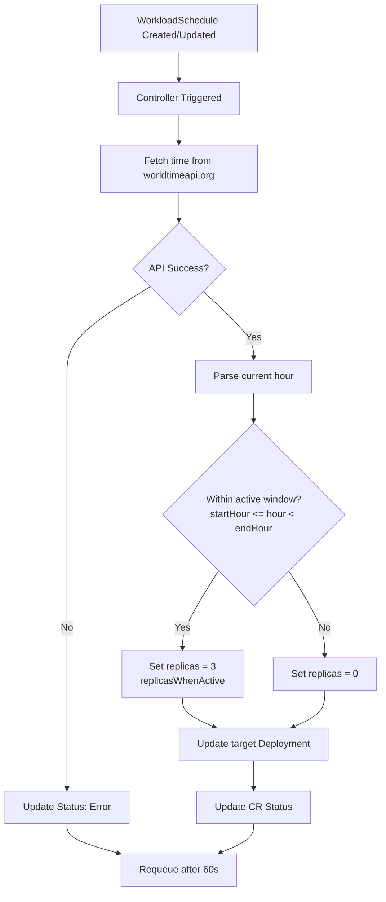
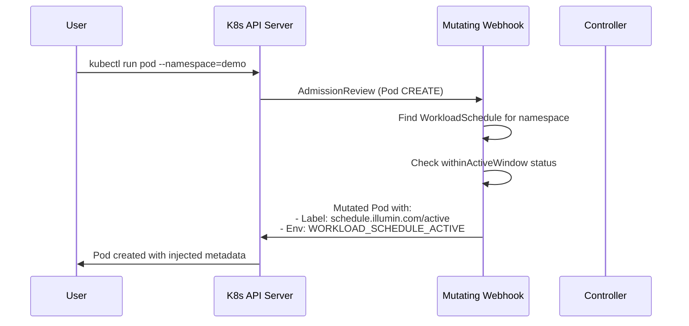

# WorkloadSchedule Operator

A Kubernetes operator that automatically scales deployments based on time-of-day schedules using real-time timezone data from [worldtimeapi.org](https://worldtimeapi.org/).

## Overview

This operator implements a Custom Resource Definition (CRD) called `WorkloadSchedule` that allows you to define time-based scaling rules for Kubernetes deployments. The operator:

1. **Fetches real-time timezone data** from the World Time API
2. **Determines if the current time** falls within a configured "active window"
3. **Scales target deployments** to the specified replica count during active hours, or to 0 during inactive hours
4. **Injects metadata** into Pods via a mutating admission webhook

## Architecture

```
┌───────────────────────────────────────────────────────────────────────-──────┐
│                           Kubernetes Cluster                                 │
│                                                                              │
│  ┌────────────────────────────────────────────────────────────────────────┐  │
│  │                    workload-schedule-operator-system                   │  │
│  │                                                                        │  │
│  │   ┌──────────────────────────────────────────────────────────────┐     │  │
│  │   │              Controller Manager Pod                          │     │  │
│  │   │  ┌─────────────────────┐    ┌─────────────────────────────┐  │     │  │
│  │   │  │    Controller       │    │    Mutating Webhook         │  │     │  │
│  │   │  │  (Reconciler)       │    │   (Pod Interceptor)         │  │     │  │
│  │   │  │                     │    │                             │  │     │  │
│  │   │  │  • Watch CRs        │    │  • Intercept Pod CREATE     │  │     │  │
│  │   │  │  • Fetch time API   │    │  • Inject labels            │  │     │  │
│  │   │  │  • Scale deploys    │    │  • Inject env vars          │  │     │  │
│  │   │  └─────────────────────┘    └─────────────────────────────┘  │     │  │
│  │   └──────────────────────────────────────────────────────────────┘     │  │
│  └────────────────────────────────────────────────────────────────────────┘  │
│                                    │                                         │
│                                    │ watches                                 │
│                                    ▼                                         │
│  ┌─────────────────────────────────────────────────────────────────────────┐ │
│  │                         WorkloadSchedule CR                             │ │
│  │  spec:                                                                  │ │
│  │    timezone: "America/Toronto"                                          │ │
│  │    startHour: 9                                                         │ │
│  │    endHour: 17                                                          │ │
│  │    targetNamespace: "demo"                                              │ │
│  │    targetDeployment: "my-app"                                           │ │
│  │    replicasWhenActive: 3                                                │ │
│  └─────────────────────────────────────────────────────────────────────────┘ │
│                                    │                                         │
│                                    │ scales                                  │
│                                    ▼                                         │
│  ┌─────────────────────────────────────────────────────────────────────────┐ │
│  │                          Target Namespace (demo)                        │ │
│  │   ┌─────────────────┐  ┌─────────────────┐  ┌─────────────────┐         │ │
│  │   │   Pod (nginx)   │  │   Pod (nginx)   │  │   Pod (nginx)   │         │ │
│  │   │  replica 1/3    │  │  replica 2/3    │  │  replica 3/3    │         │ │
│  │   └─────────────────┘  └─────────────────┘  └─────────────────┘         │ │
│  └─────────────────────────────────────────────────────────────────────────┘ │
└─────────────────────────────────────────────────────────────────────────────-┘
                                     │
                                     │ queries
                                     ▼
                    ┌─────────────────────────────────┐
                    │       worldtimeapi.org          │
                    │  GET /api/timezone/America/     │
                    │              Toronto            │
                    │                                 │
                    │  Response:                      │
                    │  { "datetime": "2025-...",      │
                    │    "timezone": "America/..." }  │
                    └─────────────────────────────────┘
```

## Reconciliation Flow



## Scaling Behavior

```
                        Active Window (9 AM - 5 PM)
                          ◄─────────-───►
     
 Replicas
    3 │                   ┌─────────────┐
      │                   │             │
    2 │                   │ ACTIVE      │
      │                   │(3 replicas) │
    1 │                   │             │
      │                   │             │
    0 │───────────────────┘             └────────────────────
      └────┬────┬────┬────┬────┬────┬────┬────┬────┬────┬────┬────►
          12AM  3AM  6AM  9AM 12PM  3PM  6PM  9PM 12AM  3AM  6AM
                          ▲                   ▲
                     Scale UP            Scale DOWN
                    (9:00 AM)            (5:00 PM)

    💰 Cost Savings: Pods run only during business hours!
```

## Webhook Mutation Flow



## Component Interaction

```
┌──────────────────────────────────────────────────────────────────────┐
│                        User Actions                                  │
└──────────────────────────────────────────────────────────────────────┘
         │                           │                        │
         │ kubectl apply             │ kubectl run            │ kubectl get
         │ WorkloadSchedule          │ pod -n demo            │ workloadschedule
         ▼                           ▼                        ▼
┌─────────────────┐         ┌─────────────────┐      ┌─────────────────┐
│   CRD Created   │         │  Pod Creation   │      │  Status Query   │
│                 │         │    Request      │      │                 │
└────────┬────────┘         └────────┬────────┘      └────────┬────────┘
         │                           │                        │
         ▼                           ▼                        │
┌─────────────────┐         ┌─────────────────┐               │
│   Controller    │         │    Webhook      │               │
│   Reconcile     │◄───────►│   Mutate Pod    │               │
│                 │ status  │                 │               │
└────────┬────────┘         └─────────────────┘               │
         │                                                    │
         │ scale                                              │
         ▼                                                    │
┌─────────────────┐                                           │
│   Deployment    │                                           │
│   Scaled        │                                           │
└────────┬────────┘                                           │
         │                                                    │
         │ status update                                      │
         ▼                                                    │
┌─────────────────┐                                           │
│ WorkloadSchedule│◄──────────────────────────────────────-───┘
│    Status       │
│                 │
│ currentTime:    │
│ withinActive:   │
│ replicas:       │
└─────────────────┘
```

## Features

- ✅ Time-based deployment scaling using external timezone API
- ✅ Custom Resource Definition (`WorkloadSchedule`)
- ✅ Mutating admission webhook for Pod labeling
- ✅ Automatic namespace creation
- ✅ Finalizer support for clean resource cleanup
- ✅ Status reporting with conditions
- ✅ Local development with Kind cluster
- ✅ Comprehensive CI/CD pipeline

## Prerequisites

Before you begin, ensure you have the following installed:

| Tool | Version | Installation |
|------|---------|--------------|
| Docker | 20.10+ | [Install Docker](https://docs.docker.com/get-docker/) |
| Go | 1.22+ | [Install Go](https://golang.org/doc/install) |
| kubectl | 1.28+ | [Install kubectl](https://kubernetes.io/docs/tasks/tools/) |
| kind | 0.20+ | [Install kind](https://kind.sigs.k8s.io/docs/user/quick-start/#installation) |
| make | - | Usually pre-installed on Linux/macOS |

## Quick Start

### Option 1: Run the Full CI Pipeline

The simplest way to test the operator end-to-end:

```bash
# Clone the repository
git clone https://github.com/vmovahed/workload-schedule-operator.git
cd workload-schedule-operator

# Run the full CI pipeline
make ci
```

This will:
1. Lint and format the code
2. Build the operator binary
3. Build the container image
4. Create a Kind cluster
5. Load the image into the cluster
6. Deploy the operator
7. Run end-to-end tests

### Option 2: Step-by-Step

```bash
# Create the Kind cluster
make cluster-up

# Build the operator image
make docker-build

# Load the image into the cluster
make cluster-load-image

# Deploy the operator
make deploy

# Create a sample workload
kubectl apply -f config/samples/demo-deployment.yaml
kubectl apply -f config/samples/infra_v1alpha1_workloadschedule.yaml

# Check the status
kubectl get workloadschedules
kubectl get workloadschedule example -o yaml
```

## Usage

### WorkloadSchedule CRD

Create a `WorkloadSchedule` resource to define your scaling rules:

```yaml
apiVersion: infra.illumin.com/v1alpha1
kind: WorkloadSchedule
metadata:
  name: business-hours
spec:
  # Timezone for time calculation (uses worldtimeapi.org)
  timezone: "America/Toronto"
  
  # Active window: 9 AM to 5 PM (startHour inclusive, endHour exclusive)
  startHour: 9
  endHour: 17
  
  # Target deployment to scale
  targetNamespace: "demo"
  targetDeployment: "my-app"
  
  # Replicas during active window (0 replicas during inactive window)
  replicasWhenActive: 3
```

### Spec Fields

| Field | Type | Required | Description |
|-------|------|----------|-------------|
| `timezone` | string | Yes | IANA timezone (e.g., "America/Toronto", "Europe/London") |
| `startHour` | int | Yes | Hour when active window begins (0-23, inclusive) |
| `endHour` | int | Yes | Hour when active window ends (0-24, exclusive) |
| `targetNamespace` | string | Yes | Namespace of the target deployment |
| `targetDeployment` | string | Yes | Name of the deployment to scale |
| `replicasWhenActive` | int32 | Yes | Number of replicas during active window |

### Status Fields

| Field | Description |
|-------|-------------|
| `currentLocalTime` | Current time in the specified timezone |
| `withinActiveWindow` | Whether currently in the active window |
| `lastScaleAction` | Description of the last scaling operation |
| `lastSyncTime` | Timestamp of last successful reconciliation |
| `currentReplicas` | Current replica count of the target deployment |
| `conditions` | Standard Kubernetes conditions |

## How It Works

### Controller Reconciliation Logic

```
┌─────────────────────────────────────────────────────────────────┐
│                     RECONCILIATION LOOP                         │
│                                                                 │
│  1. USER CREATES WorkloadSchedule                               │
│     ┌─────────────────────────────────────────────────────────┐ │
│     │ spec:                                                   │ │
│     │   timezone: "America/Toronto"                           │ │
│     │   startHour: 9                                          │ │
│     │   endHour: 17                                           │ │
│     │   targetDeployment: "my-app"                            │ │
│     │   replicasWhenActive: 3    ◄── DESIRED STATE            │ │
│     └─────────────────────────────────────────────────────────┘ │
│                           │                                     │
│                           ▼                                     │
│  2. CONTROLLER CHECKS:                                          │
│     - What time is it in Toronto? → 10:00 AM (within 9-17)      │
│     - How many replicas does "my-app" have? → 0                 │
│                           │                                     │
│                           ▼                                     │
│  3. CONTROLLER RECONCILES:                                      │
│     - Desired: 3 replicas (it's business hours)                 │
│     - Actual: 0 replicas                                        │
│     - Action: SCALE UP to 3! ◄── MAKE ACTUAL = DESIRED          │
│                           │                                     │
│                           ▼                                     │
│  4. REPEAT every 60 seconds...                                  │
└─────────────────────────────────────────────────────────────────┘
```

### Mutating Admission Webhook

The webhook intercepts Pod CREATE operations and:

1. Checks if the Pod's namespace is managed by a `WorkloadSchedule`
2. If so, injects:
   - **Label**: `schedule.illumin.com/active: "true"|"false"`
   - **Environment Variable**: `WORKLOAD_SCHEDULE_ACTIVE=true|false`

This allows applications to be aware of their schedule status.

## Makefile Targets

### Cluster Management

| Target | Description |
|--------|-------------|
| `make cluster-up` | Create a local Kind cluster |
| `make cluster-down` | Delete the Kind cluster |
| `make cluster-load-image` | Load operator image into Kind |

### Development

| Target              |              Description                   |
|---------------------|--------------------------------------------|
| `make build`        | Build the operator binary                  |
| `make docker-build` | Build the container image                  |
| `make run`          | Run the operator locally (outside cluster) |
| `make manifests`    | Generate CRD and RBAC manifests            |
| `make generate`     | Generate DeepCopy methods                  |
| `make fmt`          | Format Go code                             |
| `make vet`          | Run Go vet                                 |

### Deployment

| Target            |        Description           |
|-------------------|------------------------------|
| `make deploy`     | Deploy operator to cluster   |
| `make undeploy`   | Remove operator from cluster |
| `make install`    | Install CRDs only            |
| `make uninstall`  | Uninstall CRDs               |

### Testing

| Target          |      Description     |
|-----------------|----------------------|
| `make test`     | Run unit tests       |
| `make test-e2e` | Run end-to-end tests |
| `make lint`     | Run golangci-lint    |

### CI/CD

| Target            | Description          |
|-------------------|----------------------|
| `make ci`         | Run full CI pipeline |
| `make ci-cleanup` | Clean up after CI    |

## Project Structure

```
workload-schedule-operator/
├── api/
│   └── v1alpha1/
│       └── workloadschedule_types.go    # CRD type definitions
├── cmd/
│   └── main.go                          # Operator entry point
├── config/
│   ├── crd/                             # CRD manifests
│   ├── rbac/                            # RBAC manifests
│   ├── manager/                         # Operator deployment
│   ├── webhook/                         # Webhook configuration
│   └── samples/                         # Example resources
├── internal/
│   ├── controller/
│   │   └── workloadschedule_controller.go  # Reconciliation logic
│   └── webhook/
│       └── v1/
│           └── pod_webhook.go           # Mutating webhook
├── scripts/
│   ├── cluster-up.sh                    # Create Kind cluster
│   ├── cluster-down.sh                  # Delete Kind cluster
│   ├── gen-certs.sh                     # Generate TLS certificates
│   └── e2e-test.sh                      # E2E test script
├── Dockerfile
├── Makefile
└── README.md
```

## Troubleshooting

### Check Operator Logs

```bash
kubectl logs -n workload-schedule-operator-system deployment/workload-schedule-operator-controller-manager -f
```

### Check WorkloadSchedule Status

```bash
kubectl get workloadschedule -o wide
kubectl describe workloadschedule <name>
```

### Verify CRD Installation

```bash
kubectl get crd workloadschedules.infra.illumin.com
```

### Check Target Deployment

```bash
kubectl get deployment -n <namespace> <deployment-name>
kubectl describe deployment -n <namespace> <deployment-name>
```

### Common Issues

1. **World Time API Errors**: The API may rate-limit requests. Check operator logs for HTTP errors.

2. **Deployment Not Found**: Ensure the target deployment exists before creating the WorkloadSchedule.

3. **Webhook Not Working**: Verify the webhook certificate is valid and the MutatingWebhookConfiguration is properly configured.

4. **Scaling Issues**: Check RBAC permissions - the operator needs access to deployments in the target namespace.

## Cleanup

```bash
# Remove sample resources
kubectl delete -f config/samples/infra_v1alpha1_workloadschedule.yaml
kubectl delete -f config/samples/demo-deployment.yaml

# Undeploy the operator
make undeploy

# Delete the cluster
make cluster-down
```

## Development

### Running Locally

To run the operator outside the cluster for debugging:

```bash
# Install CRDs
make install

# Run the operator locally
make run
```

### Adding New Features

1. Modify the CRD types in `api/v1alpha1/workloadschedule_types.go`
2. Run `make generate manifests` to regenerate code
3. Update the controller logic in `internal/controller/`
4. Add tests and run `make test`

## License

Copyright 2025.

Licensed under the Apache License, Version 2.0.
